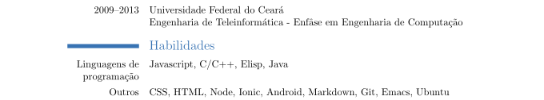

## Curriculum Vitae
Natan's CV made in latex and html.

### Curriculum Vitae latex
#### Version 0
- [cv-0.tex](./latex/cv-0.tex)
- [cv-0.pdf](./latex/cv-0.pdf)

#### Version 1
- [cv-1.tex](./latex/cv-1.tex)
- [cv-1.pdf](./latex/cv-1.pdf)
